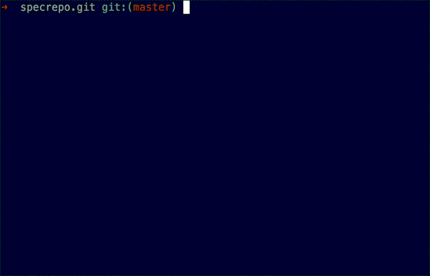

# Poper

[](https://travis-ci.org/mmozuras/poper)
+[](https://codeclimate.com/github/mmozuras/poper)
+[](https://codeclimate.com/github/mmozuras/poper)
[](http://badge.fury.io/rb/poper)
[](https://gemnasium.com/mmozuras/poper)

Poper makes sure that your git commit messages are well-formed. It's partly
inspired by [this article][] written by [tpope][]. Rules specified there form
the basis of [Poper rules][]. But Poper doesn't stop there. It also doesn't
like generic commit messages like 'oops, fix tests'. Poper was created to be
used by [Pronto][], but will work perfectly well in whatever scenario you'll
come up for it!

## Usage



Install Poper like any other gem and then run it from your terminal, specifying
a commit:

```bash
  gem install poper
  cd /repo/which/commits/you/want/to/check
  poper run HEAD~3
```

Every commit between current HEAD and specified commit will be checked.

[this article]: http://tbaggery.com/2008/04/19/a-note-about-git-commit-messages.html
[tpope]: https://twitter.com/tpope
[Poper rules]: https://github.com/mmozuras/poper/tree/master/lib/poper/rule
[Pronto]: https://github.com/mmozuras/pronto

## Configuration

The behavior of Poper can be controlled via the `.poper.yml` configuration
file. It must be placed in your project directory. A sample file, `.poper.sample.yml`, is included for easy setup.

The file has the following format:

```yaml
disallow_single_word:
  enabled: true

character_limit:
  enabled: true
  number: 72

summary_character_limit:
  enabled: true
  number: 50

disallow_generic:
  enabled: true
  words:
    - fix
    - fixed
    - fixes
    - oops
    - todo
    - fixme
    - commit
    - changes
    - hm
    - hmm
    - hmmm
    - test
    - tests
    - quickfix

enforce_capitalized:
  enabled: true
```

All properties that can be specified via `.poper.yml`, can also be specified
via environment variables. Their names will be the upcased path to the property.
For example: `POPER_ENFORCE_CAPITALIZED_ENABLED` or `POPER_DISALLOW_GENERIC_WORDS`. (In the case of the latter, since environment variables don't support arrays, use a comma-separated list of words and poper will parse them appropriately.) Environment variables
will always take precedence over values in configuration file.
